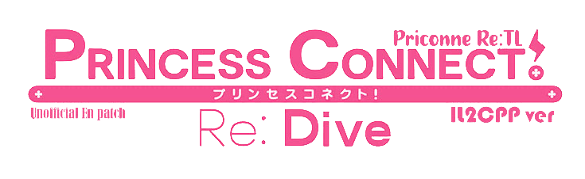

<h2 align="center">


[](https://github.com/ImaterialC/PriconneRe-TL/releases/latest "Download") [](https://discord.gg/vZjAy67KpB "Discord") [](https://github.com/BepInEx/BepInEx "BepInEx") [](https://github.com/bbepis/XUnity.AutoTranslator "AutoTranslator") [](https://opensource.org/licenses/MIT) [](#-donation "Donate")

<i>An English patch for Princess Connect! ReDive JP server</i>
</h2>

---

⚠️ **Warning:** _Please use it at your own risk!!  We are not responsible for any actions taken toward your account if you use this translation tool_

Priconne Re: TL is an unofficial English UI patch for [Cygames' Princess Connect Re: Dive JP](https://dmg.priconne-redive.jp/). This project's main focus is translating the game's user interface into English so non-Japanese people can play it easier.

_Any help and contributions are welcome!_

---

##  Table of contents
- [ Table of contents](#-table-of-contents)
- [ INSTALLATION](#-installation)
- [ UPDATING](#-updating)
- [ UNINSTALLATION](#-uninstallation)
- [ SETTINGS, OPTIONS, AND FEATURES](#-settings-options-and-features)
- [ DONATION](#-donation)


##  INSTALLATION

1. Make sure that you installed [PriconneR](https://dmg.priconne-redive.jp/) from DMM Game Launcher, not via Android Emulator
2. Download the latest release asset from [latest release](https://github.com/ImaterialC/PriconneRe-TL/releases/latest "Releases")
3. Extract all files from zip files to your `priconner` folder
4. Make sure your `priconner` folder looks like this


_The first run will cause a freeze for minutes, the second run and so on will be like usual._

##  UPDATING

It is recommended to delete the old patch files instead of just replacing them

Delete the old `BepInEx` folder then extract the zip files again.

##  UNINSTALLATION

Simply delete patch files that were extracted to the `priconner` folder
No Priconne files that were modified or damaged while installing this patch so you can simply delete them manually. Your game will turn back to a vanilla state.

Files that must delete for uninstalling were:
```
BepInEx
dotnet
changelog.txt
doorstop_config.ini
winhttp.dll
.doorstop_version
```

The Vanilla state of the priconner folder was like the below picture:


##  SETTINGS, OPTIONS, AND FEATURES

- Using [A fork of BepInEx Bleeding Edge](https://github.com/krulci/BepInEx) as the framework to inject [Kevga/XUnity.AutoTranslator](https://github.com/Kevga/XUnity.AutoTranslator) plugin.
- You can find their config here:
  - [BepInEx Config](https://docs.bepinex.dev/articles/user_guide/configuration.html)
  - [AutoTranslator Config](https://github.com/bbepis/XUnity.AutoTranslator#configuration)
- [krulci/BepInEx.FullScreenizer](https://github.com/krulci/FullScreenizer). You can press F4 to toggle fullscreen
- 16:9 aspect ratio and can maximize or adjust client sizes larger than 720p for a better experience on the modern monitor resolution.
- 2 strategies on textures based on size for Atlases and Name for others else, it will auto revert when textures are changed and unusable. **Unfortunately, AMD GPU users will need to replace atlas textures manually due to different compressing sizes.**

##  DONATION

Any donation is a huge encouragement for having more motivation to maintain text and texture translation. Many thanks, You guys! 

Your name will appear on monthly video on [my channel](https://www.youtube.com/playlist?list=PL7rvyKiF8qfl4WgOAcSOuYnkg4fEbL66c)

[](https://ko-fi.com/E1E5HG8RP) [](https://saweria.co/imaterial "Saweria.co") [](https://patreon.com/imaterial "patreon.com")
